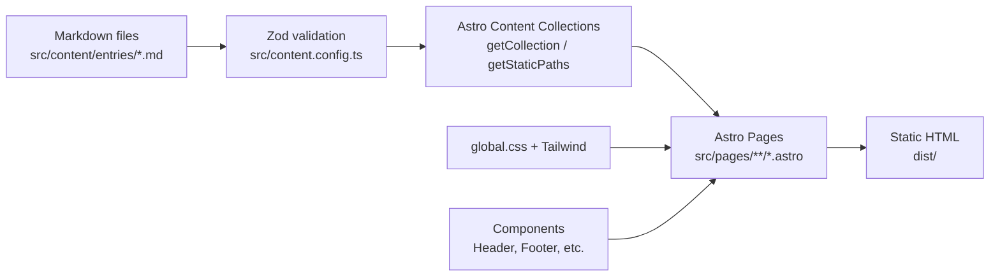

# Architecture

## Tech Stack

| Layer | Technology | Version |
|-------|-----------|---------|
| Framework | Astro | ^6.1.5 |
| Language | TypeScript | ^5.0.0 |
| Styling | Tailwind CSS | ^3.4.17 |
| CSS Processing | PostCSS + Autoprefixer | ^8.5.1 / ^10.4.21 |
| Type Checking | @astrojs/check | ^0.9.0 |
| Content | Astro Content Collections + Zod | built-in |
| Node | 22 (see `.node-version`) |
| Package Manager | npm (also has `bun.lock`) |

## Project Structure

```
mythic-pages/
├── astro.config.mjs          # Astro config (trailingSlash, build format)
├── package.json               # Dependencies and scripts
├── tailwind.config.ts         # Tailwind theme (shadcn-like tokens, mostly unused)
├── tsconfig.json              # Extends astro/tsconfigs/base
├── postcss.config.js          # PostCSS plugins
├── components.json            # shadcn scaffold config (legacy, not active)
├── public/                    # Static assets
│   ├── favicon.ico
│   ├── placeholder.svg
│   └── robots.txt
└── src/
    ├── content.config.ts      # Zod schema for entries collection
    ├── env.d.ts               # Astro type references
    ├── data/
    │   └── category-labels.ts # Category slug → Vietnamese label map
    ├── content/
    │   └── entries/           # Markdown content files (one per mythological entry)
    │       ├── au-co.md
    │       ├── ho-tinh.md
    │       ├── lac-long-quan.md
    │       ├── moc-tinh.md
    │       ├── ngu-tinh.md
    │       └── thanh-giong.md
    ├── layouts/
    │   ├── BaseLayout.astro   # Minimal shell: <html>, global.css, Header, Footer
    │   └── EntryLayout.astro  # Full entry page: standalone <html>, sidebar, typography
    ├── pages/                 # File-based routing
    │   ├── index.astro        # Home page
    │   └── entries/
    │       ├── index.astro    # Entries catalog
    │       ├── [id].astro     # Entry detail (dynamic)
    │       └── category/
    │           └── [category].astro  # Category filter (dynamic)
    ├── styles/
    │   └── global.css         # CSS variables, reset, base typography
    ├── components/
    │   ├── Header.astro       # Fixed nav bar
    │   ├── Footer.astro       # Site footer
    │   ├── EntriesListPage.astro  # Shared list page (catalog + category filter)
    │   ├── EntryCard.astro    # ⚠️ UNUSED — not imported anywhere
    │   ├── InfoTable.astro    # ⚠️ UNUSED — sidebar info table
    │   ├── RelationshipSection.astro  # ⚠️ UNUSED
    │   ├── SidebarCard.astro  # ⚠️ UNUSED
    │   ├── ThemeCloud.astro   # ⚠️ UNUSED
    │   └── wiki/              # ⚠️ UNUSED React components (no React installed)
    │       ├── InfoTable.tsx
    │       ├── RelatedEntries.tsx
    │       ├── RelationshipSection.tsx
    │       ├── SidebarCard.tsx
    │       └── ThemeCloud.tsx
    └── test/
        ├── setup.ts
        └── example.test.ts
```

## Build Pipeline



## Build Commands

| Command | What It Does |
|---------|-------------|
| `npm run dev` | `astro dev` — local dev server |
| `npm run build` | `astro build` — generate static site to `dist/` |
| `npm run preview` | `astro preview` — preview built site |
| `npm run check` | `astro check` — TypeScript type checking |

## Astro Config

File: `astro.config.mjs`

```js
export default defineConfig({
  trailingSlash: "ignore",  // both /entries and /entries/ work
  build: {
    format: "directory",    // dist/entries/index.html (not entries.html)
  },
});
```

- No integrations installed (no `@astrojs/react`, no `@astrojs/tailwind`)
- No server adapter → pure static output
- No redirects active (commented out)

## Deploy

- Output: `dist/` directory (gitignored)
- No `vercel.json`, `netlify.toml`, or Dockerfile
- Compatible with any static hosting
- SEO: `robots.txt` allows common crawlers, entry pages set `<meta description>`
