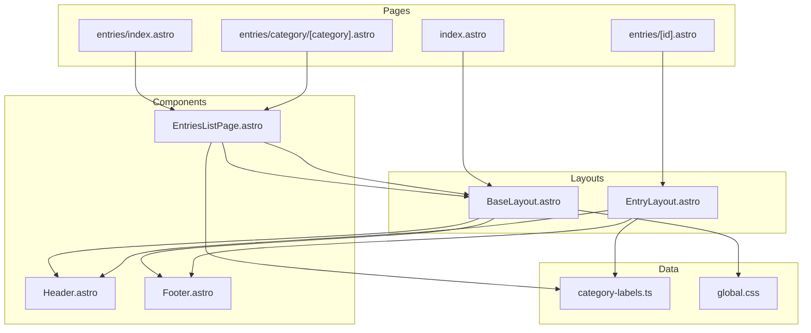

# Components

## Active Components

### Header.astro

File: `src/components/Header.astro`

**Props**: None

**Renders**: Fixed top navigation bar with:
- Logo (神 mark + "Thần Thoại Việt")
- Nav links: Trang chủ, Mục lục, Phân loại, Về dự án
- Language switch buttons (VI/EN) — **non-functional**, buttons have no handlers

**Styling**: `<style is:global>` — fixed position, backdrop blur, responsive (hides nav links on mobile)

**Used by**: `BaseLayout.astro`, `EntryLayout.astro`

---

### Footer.astro

File: `src/components/Footer.astro`

**Props**: None

**Renders**: Dark footer with 4-column grid:
- Brand column (description)
- Khám phá (links: Trang chủ, Mục lục, Phân loại)
- Tư liệu (links: Lĩnh Nam Chích Quái, etc. — all `href="#"`)
- Liên hệ (links: Đóng góp, Github, Email — all `href="#"`)
- Bottom bar: copyright + "Made with ♡ in Việt Nam"

**Used by**: `BaseLayout.astro`, `EntryLayout.astro`

---

### EntriesListPage.astro

File: `src/components/EntriesListPage.astro`

**Props**:
```typescript
interface Props {
  entries: CollectionEntry<'entries'>[];
  activeCategory: string | null;  // null = show all
  totalPublished: number;
}
```

**Renders**: Full catalog page inside `BaseLayout`:
1. Page header with "Mục lục" title + description
2. Sticky filter bar with category pills (links to `/entries/category/[slug]`)
3. 3-column card grid of entries (image placeholder, category tag, name, summary)

**Used by**: `entries/index.astro`, `entries/category/[category].astro`

**Key behavior**:
- `activeCategory` determines which pill is highlighted and description text
- Card grid renders inline (does NOT use `EntryCard.astro`)

---

### BaseLayout.astro

File: `src/layouts/BaseLayout.astro`

**Props**: `{ title: string }`

**Renders**:
```html
<!DOCTYPE html>
<html lang="vi">
  <head><!-- meta, title --></head>
  <body>
    <Header />
    <main><slot /></main>
    <Footer />
  </body>
</html>
```

Imports `global.css`.

**Used by**: `index.astro`, `EntriesListPage.astro`

---

### EntryLayout.astro

File: `src/layouts/EntryLayout.astro`

**Props**: `{ entry: any; related?: any[] }`

**Renders**: Complete standalone HTML document (NOT extending BaseLayout):

```
<html>
  <head> (fonts, meta description) </head>
  <body>
    Header
    entry-head (breadcrumb, group, title, aliases, han/en names, tags)
    main-grid:
      <article>
        hero-img placeholder
        summary box
        <slot /> (markdown Content)
        sources list
        related entries grid
      </article>
      <aside> (sticky sidebar)
        Info table (category, gender, era, region, location, group)
        Relations (family, allies, enemies, artifacts)
        Theme tags
      </aside>
    Footer
  </body>
</html>
```

**Data processing** (in frontmatter script):
- `infoRows` — builds info table from entry data
- `relGroups` — filters non-empty relation groups
- `slugToLabel()` — converts theme slugs to display text

**Used by**: `entries/[id].astro`

## Unused Components

These files exist but are **not imported by any page or layout**:

| File | Original Purpose | Status |
|------|-----------------|--------|
| `src/components/EntryCard.astro` | Entry card for lists | Replaced by inline markup in `EntriesListPage` |
| `src/components/InfoTable.astro` | Sidebar info table | Functionality built into `EntryLayout` |
| `src/components/RelationshipSection.astro` | Relation groups | Functionality built into `EntryLayout` |
| `src/components/SidebarCard.astro` | Sidebar card wrapper | Functionality built into `EntryLayout` |
| `src/components/ThemeCloud.astro` | Theme tag cloud | Functionality built into `EntryLayout` |
| `src/components/wiki/*.tsx` | React versions of above | No React installed — completely dead code |

**Recommendation**: These can be deleted or refactored into active use. The `wiki/*.tsx` files require `@astrojs/react` integration which is not installed.

## Component Dependency Graph


