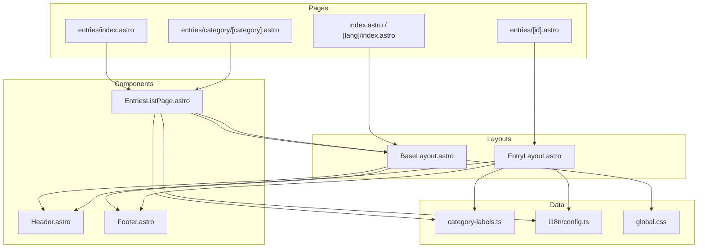

# Components

## Active Components

### Header.astro

File: `src/components/Header.astro`

**Props**: `{ lang?: Locale }` (default `'vi'`)

**Renders**: Fixed top navigation bar with:
- Logo (神 mark + "Thần Thoại Việt" — brand text not yet fully localized)
- Nav links from `t(lang, 'nav.*')` with `href` from `localePath(lang, ...)` in `src/i18n/paths.ts` (About → `/about` or `/{lang}/about`)
- Language switch: `<a>` links generated from `locales` via `alternateLocalePath(pathname, locale)`

**Styling**: `<style is:global>` — fixed position, backdrop blur, responsive (hides nav links on mobile)

**Used by**: `BaseLayout.astro`, `EntryLayout.astro`

---

### HomePage.astro

File: `src/components/HomePage.astro`

**Props**: `{ lang: Locale }`

**Renders**: Full home page content (hero, featured, categories, quote) inside `BaseLayout`; internal links use `localePath` from `src/i18n/paths.ts`.

**Used by**: `src/pages/index.astro` (`lang="vi"`), `src/pages/[lang]/index.astro` (`lang` dynamic)

---

### AboutPage.astro

File: `src/components/AboutPage.astro`

**Props**: `{ lang: Locale }`

**Renders**: Shared About content (hero, prose, CTA, roadmap) with localized copy via `t(lang, 'about.*')`.

**Used by**: `src/pages/about.astro` (`lang="vi"`), `src/pages/[lang]/about.astro` (`lang` dynamic)

---

### Footer.astro

File: `src/components/Footer.astro`

**Props**: `{ lang?: Locale }` (default `'vi'`)

**Renders**: Dark footer with 4-column grid; labels via `t(lang, 'footer.*')` and explore links via `localePath(lang, ...)`

**Used by**: `BaseLayout.astro`, `EntryLayout.astro`

---

### EntriesListPage.astro

File: `src/components/EntriesListPage.astro`

**Props**:
```typescript
interface Props {
  entries: any[];  // localized collection entries from getLocalizedEntries
  activeCategory: string | null;
  totalPublished: number;
  lang?: Locale;
}
```

**Renders**: Full catalog page inside `BaseLayout`:
1. Page header — `t(lang, 'entries.*')`
2. Sticky filter bar with category pills linking to `localePath(lang, '/entries/category/[slug]')`
3. 3-column card grid of entries (image placeholder, category tag, name, summary)

**Used by**: `entries/index.astro`, `[lang]/entries/index.astro`, `entries/category/[category].astro`, `[lang]/entries/category/[category].astro`

**Key behavior**:
- `activeCategory` determines which pill is highlighted
- Card grid renders inline (does NOT use `EntryCard.astro`)

---

### BaseLayout.astro

File: `src/layouts/BaseLayout.astro`

**Props**: `{ title: string; lang?: Locale }`

**Renders**:
```html
<!DOCTYPE html>
<html lang={lang}>
  <head><!-- meta, title --></head>
  <body>
    <Header lang={lang} />
    <main><slot /></main>
    <Footer lang={lang} />
  </body>
</html>
```

Imports `global.css`.

**Used by**: `index.astro`, `[lang]/index.astro` (via `HomePage.astro`), `EntriesListPage.astro`, `AboutPage.astro`

---

### EntryLayout.astro

File: `src/layouts/EntryLayout.astro`

**Props**: `{ entry: any; related?: any[]; lang?: Locale }` (see file for exact interface)

**Renders**: Complete standalone HTML document (NOT extending `BaseLayout`):

```
<html lang={lang}>
  <head> (fonts, meta description) </head>
  <body>
    Header
    entry-head (breadcrumb, group, title, aliases, han/en names, tags)
    main-grid:
      <article>
        hero-img placeholder
        summary box
        <slot /> (markdown Content)
        sources list
        related entries grid
      </article>
      <aside> (sticky sidebar)
        Info table (category, gender, era, region, location, group)
        Relations (family, allies, enemies, artifacts)
        Theme tags
      </aside>
    Footer
  </body>
</html>
```

**Data processing** (in frontmatter script):
- `infoRows` — builds info table from entry data
- `relGroups` — filters non-empty relation groups
- `slugToLabel()` — converts theme slugs to display text
- Category/region/gender labels use `getCategoryLabel` and `t(lang, ...)`

**Used by**: `entries/[id].astro`, `[lang]/entries/[id].astro`

## Component Dependency Graph


