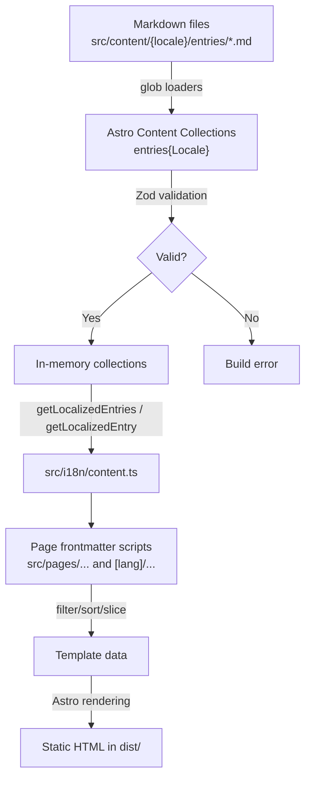
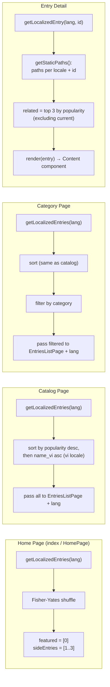
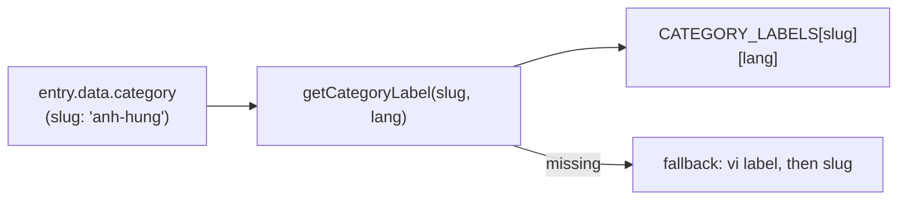

# Data Flow

All data is resolved at **build time**. There is no runtime API, no database, no client-side state.

## Content Pipeline Overview



## Step-by-Step Flow

### 1. Content Loading

```
src/content/{locale}/entries/*.md   → collection entries{Locale}
        ↓
glob({ pattern: '**/*.md', base: './src/content/{locale}/entries' })
        ↓
Each .md file parsed: YAML frontmatter → data, body → markdown
        ↓
entry.id = filename without .md (e.g. "thanh-giong")
```

### 2. Schema Validation

```
entry.data (frontmatter) → Zod schema validation (shared entrySchema)
        ↓
Required fields: name_vi, category
Defaults applied: popularity=1, status='published'
Optional fields: all others
        ↓
Type-safe entry objects: CollectionEntry<`entries${Capitalize<Locale>}`>
```

### 3. Locale fallback (generic)

For **any non-default locale**, `getLocalizedEntries`:

1. Loads published entries from `entries{Locale}`
2. Loads published entries from default-locale collection
3. Appends default-locale entries whose `id` is missing in requested locale

So localized catalogs and static paths include every story from the canonical default locale even before translation exists.

### 4. Page Data Resolution



### 5. Sort Logic

Used in catalog and category pages:

```typescript
entries.sort((a, b) => {
  if ((b.data.popularity ?? 0) !== (a.data.popularity ?? 0)) {
    return (b.data.popularity ?? 0) - (a.data.popularity ?? 0);
  }
  return (a.data.name_vi ?? '').localeCompare(b.data.name_vi ?? '', 'vi');
});
```

### 6. Related Entries Logic

In `entries/[id].astro` and `[lang]/entries/[id].astro` → `getStaticPaths()` / props:

```typescript
related: published
  .filter(e => e.id !== entry.id)
  .sort((a, b) => (b.data.popularity ?? 1) - (a.data.popularity ?? 1))
  .slice(0, 3)
```

### 7. Markdown Rendering

```typescript
const { Content } = await render(entry);
```

The rendered markdown receives typography from `EntryLayout`'s `.entry-content` styles.

## Category Labels Resolution



Used in: `EntriesListPage`, `EntryLayout`, `HomePage`

## Data Flow per Page

| Page | Input | Transform | Output |
|------|-------|-----------|--------|
| `/`, `/en/` | Localized published entries | Shuffle → take first 4 | Featured card + 3 side cards |
| `/entries`, `/{lang}/entries` | Localized entries | Sort by popularity/name | Full card grid |
| `/.../entries/category/X` | Localized entries | Sort → filter by category | Filtered card grid |
| `/.../entries/Y` | `getLocalizedEntry` + published | render() + top 3 related | Full article + sidebar + related |

## Key Gotcha

The home page uses **random shuffle** (`Math.random()`) — so featured entries change on every build. This is intentional for variety but means builds are non-deterministic.
