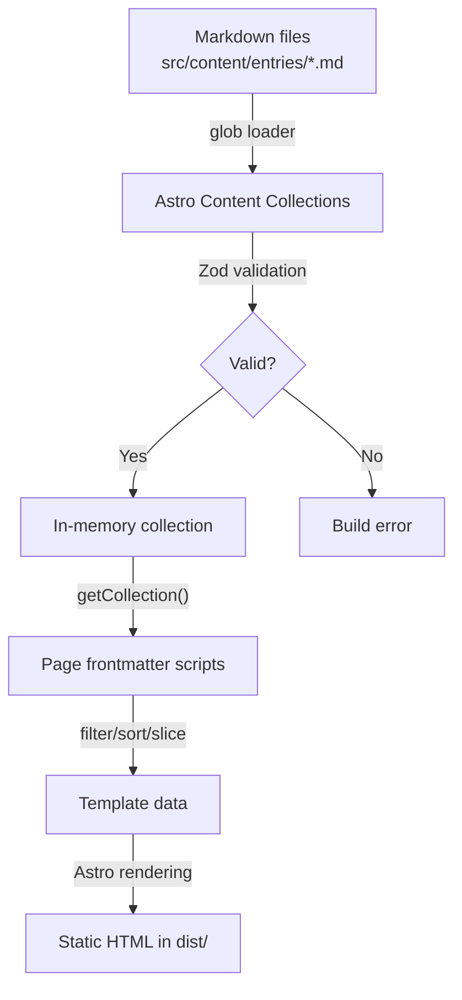
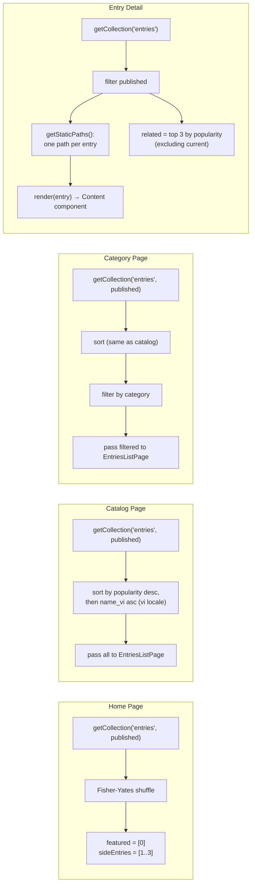
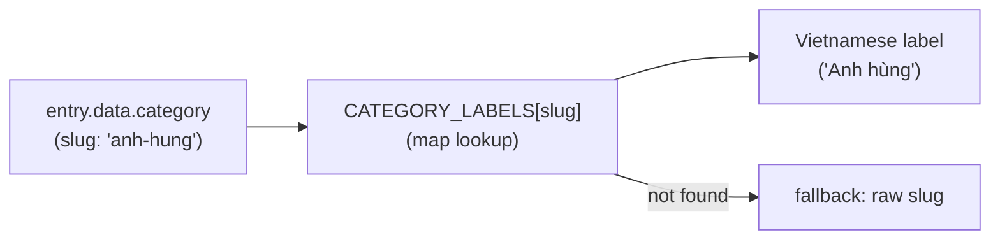

# Data Flow

All data is resolved at **build time**. There is no runtime API, no database, no client-side state.

## Content Pipeline Overview



## Step-by-Step Flow

### 1. Content Loading

```
src/content/entries/*.md
        ↓
glob({ pattern: '**/*.md', base: './src/content/entries' })
        ↓
Each .md file parsed: YAML frontmatter → data, body → markdown
        ↓
entry.id = filename without .md (e.g. "thanh-giong")
```

### 2. Schema Validation

```
entry.data (frontmatter) → Zod schema validation
        ↓
Required fields: name_vi, category
Defaults applied: popularity=1, status='published'
Optional fields: all others
        ↓
Type-safe entry object: CollectionEntry<'entries'>
```

### 3. Page Data Resolution

Each page fetches data differently:



### 4. Sort Logic

Used in catalog and category pages:

```typescript
entries.sort((a, b) => {
  // Primary: popularity descending
  if ((b.data.popularity ?? 0) !== (a.data.popularity ?? 0)) {
    return (b.data.popularity ?? 0) - (a.data.popularity ?? 0);
  }
  // Secondary: name_vi ascending (Vietnamese locale)
  return (a.data.name_vi ?? '').localeCompare(b.data.name_vi ?? '', 'vi');
});
```

### 5. Related Entries Logic

In `[id].astro` → `getStaticPaths()`:

```typescript
related: published
  .filter(e => e.id !== entry.id)        // exclude current
  .sort((a, b) => (b.data.popularity ?? 1) - (a.data.popularity ?? 1))  // by popularity
  .slice(0, 3)                           // top 3
```

### 6. Markdown Rendering

```typescript
const { Content } = await render(entry);
// Content is an Astro component that renders the markdown body
// Passed as <slot> to EntryLayout
```

The rendered markdown receives typography from `EntryLayout`'s `.entry-content` styles.

## Category Labels Resolution



Used in: `EntriesListPage` (tags), `EntryLayout` (breadcrumb, info table), `index.astro` (featured)

## Data Flow per Page

| Page | Input | Transform | Output |
|------|-------|-----------|--------|
| `/` | All published entries | Shuffle → take first 4 | Featured card + 3 side cards |
| `/entries` | All published entries | Sort by popularity/name | Full card grid |
| `/entries/category/X` | All published entries | Sort → filter by category | Filtered card grid |
| `/entries/Y` | Single entry + all published | render() + top 3 related | Full article + sidebar + related |

## Key Gotcha

The home page uses **random shuffle** (`Math.random()`) — so featured entries change on every build. This is intentional for variety but means builds are non-deterministic.
