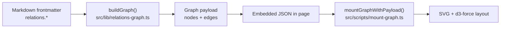

# Relation network graph

## Overview

The **relation graph** visualizes how mythology entries are linked from `frontmatter.relations` (free-text strings). It is built on every build: new markdown entries appear automatically without wiring code.

## Architecture

## Matcher rules

1. **Normalize** each relation string: strip `(qualifier)` for matching, normalize separators (`·`, `,`, dashes), NFC, lowercase, collapse spaces.
2. **Qualifier** for edge labels: first `(...)` in the original string (e.g. `(vợ)`, `(cha)`).
3. **Lookup** (exact match on normalized strings):
   - `name_vi`
   - `name_en`
   - each `aliases[]` entry
4. **No match** → **ghost node** (`ghost::<hash>`): dotted outline, no link, no fill.

## Relation kinds

Kinds map 1:1 to `relations` in the schema: `family`, `teachers`, `allies`, `cohabitors`, `allied_historical`, `enemies`, `artifacts`, `mythic_events`, `historic_events`, `related_sites`.

## Surfaces

| Surface | Route | Component |
|--------|-------|-----------|
| Full graph | `/relations`, `/en/relations` | `RelationsPage.astro` |
| Mini graph (1-hop, max 25 nodes) | Entry detail | `RelationMiniGraph.astro` in `EntryLayout` |

## Visual spec

- **Nodes**: vermilion dots (`--vermilion`), optional Han glyph; ghost nodes dashed stroke, no fill.
- **Edges**: thin strokes by kind (family vermilion, enemies brown-red, allies gold, etc.); hover shows qualifier in an ink-style caption.
- **Background**: paper (`--paper`) consistent with `global.css`.

## Client behavior

- **Layout**: ~320 fixed d3-force ticks on load; drag updates positions without re-running the full simulation.
- **Zoom/pan**: d3-zoom on the SVG viewport.
- **Filters** (global page only): relation-kind pills (subset toggle) and category pills (dim non-matching nodes to 15% opacity).

## Extending

### Adding a relation kind

1. Add the field to `relations` in `src/content.config.ts` (Zod).
2. Add `RelationKind` + `RELATION_KEYS` entry in `src/lib/relations-graph.ts`.
3. Add `STROKE` color in `src/scripts/mount-graph.ts`.
4. Add UI label key under `entry.*` in `src/i18n/config.ts` (or reuse existing keys).

### Tuning the matcher

Edit `normalizeForMatch()` and `resolveTarget()` in `src/lib/relations-graph.ts`. Keep matching **exact**; avoid fuzzy matching to reduce false positives.

## Limits

- **Ghost nodes**: unmatched strings remain visible but demoted; stats line shows unresolved count.
- **Mini graph**: one hop from the current entry; capped at 25 nodes (priority by relation kind order in `buildLocalSubgraph()`).
- **Duplicate names**: first registered name in the lookup map wins; use `aliases` to disambiguate.

## Accessibility

- SVG has `role="img"` and a descriptive `aria-label` (i18n).
- A visually hidden list of edges is rendered for screen readers / keyboard users.

## Tests

`src/test/relations-graph.test.ts` covers matching, ghosts, and local subgraph behavior. Run: `bun run test`.
