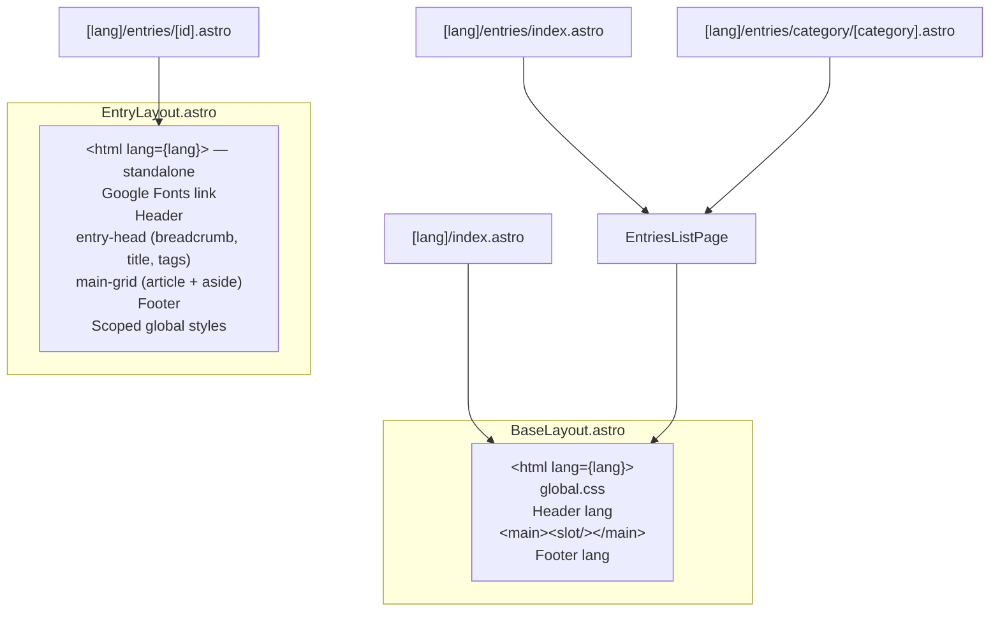

# Routing & Pages

Astro uses file-based routing. The **locale** is the first path segment: `[lang]` is `vi` or `en`. The root page only redirects to the default locale.

## Route Map

| URL Pattern | File | Layout | Description |
|------------|------|--------|-------------|
| `/` | `src/pages/index.astro` | — | 301 redirect to `/vi/` |
| `/vi/`, `/en/` | `src/pages/[lang]/index.astro` | `BaseLayout` | Home — hero, featured entries, category grid, quote |
| `/vi/about`, `/en/about` | `src/pages/[lang]/about.astro` | `BaseLayout` | About — mission, contribute/issue CTAs (placeholders), roadmap |
| `/vi/entries`, `/en/entries` | `src/pages/[lang]/entries/index.astro` | `BaseLayout` (via `EntriesListPage`) | Full catalog of published entries (EN uses VI fallback for missing files) |
| `/vi/entries/category/[category]`, `/en/entries/category/[category]` | `src/pages/[lang]/entries/category/[category].astro` | `BaseLayout` (via `EntriesListPage`) | Filtered list by category |
| `/vi/entries/[id]`, `/en/entries/[id]` | `src/pages/[lang]/entries/[id].astro` | `EntryLayout` | Entry detail (EN falls back to VI markdown when no EN file) |

## Request Flow

```mermaid
graph TD
    subgraph "Build Time (getStaticPaths)"
        A[getLocalizedEntries / getLocalizedEntry] --> B{Filter: status = published}
        B --> C[Generate static paths per lang + id/category]
    end

    subgraph "URL Resolution"
        D["/ "] --> R[redirect to /vi/]
        E["/vi/ /en/"] --> F["[lang]/index.astro"]
        G["/vi/entries"] --> H["[lang]/entries/index.astro"]
        I["/vi/entries/category/than-linh"] --> J[category/[category].astro]
        K["/vi/entries/thanh-giong"] --> L["[id].astro"]
    end

    subgraph "Layout Selection"
        F --> M[BaseLayout lang=...]
        H --> N[EntriesListPage → BaseLayout]
        J --> N
        L --> O[EntryLayout — standalone]
    end
```

## Layout Hierarchy



**Key distinction**: `EntryLayout` does NOT extend `BaseLayout`. It is a complete standalone HTML document with its own `<html>`, font imports, and extensive scoped styles.

## Page Details

### Home Page (`/vi/`, `/en/`)

File: `src/pages/[lang]/index.astro`

**Params:** `lang` from `getStaticPaths()` (`locales` from `src/i18n/config.ts`).

**Data fetching:**
- `getLocalizedEntries(lang)` → published entries for that locale (EN includes VI fallbacks for missing EN files)
- Fisher-Yates shuffle → random `featured` (first) + `sideEntries` (next 3)
- Category grid uses `CATEGORY_SLUGS` + `getCategoryLabel(slug, lang)`; links go to `/${lang}/entries/category/${slug}`

**Sections:**
1. Hero — `t(lang, ...)` for titles and CTAs
2. Featured — random featured entry card + 3 side cards
3. Categories — grid of category cards (locale-aware hrefs)
4. Quote — blockquote (anchor `id="quote"`)

### Entries Catalog (`/vi/entries`, `/en/entries`)

File: `src/pages/[lang]/entries/index.astro`

**Data fetching:**
- `getLocalizedEntries(lang)`, sorted by `popularity` desc → `name_vi` asc (Vietnamese locale)

**Delegates to**: `EntriesListPage.astro` with `activeCategory={null}` and `lang`

### Category Page (`/vi/entries/category/[category]`, …)

File: `src/pages/[lang]/entries/category/[category].astro`

**Static paths**: Generated from `CATEGORY_SLUGS` × `locales`

**Data fetching:**
- Same sort as catalog, then filtered by `entry.data.category === category`

**Delegates to**: `EntriesListPage.astro` with `activeCategory={category}` and `lang`

### Entry Detail (`/vi/entries/[id]`, …)

File: `src/pages/[lang]/entries/[id].astro`

**Static paths**: For each locale, paths for published entries (see `getAllEntryIds` + localized entry resolution per locale).

**Props computed in `getStaticPaths`:**
- `entry` — from `getLocalizedEntry(lang, id)` (may be VI content when `lang === 'en'` and EN file absent)
- `related` — top 3 other entries by popularity (excluding current)
- `lang`

**Rendering:**
- `render(entry)` → `{ Content }` component for markdown body
- Passed to `EntryLayout` as `<Content />` slot

## getStaticPaths Pattern

Dynamic routes use `lang` plus existing params. Example shape:

```typescript
export async function getStaticPaths() {
  const locales = ['vi', 'en'] as const;
  const paths = [];
  for (const lang of locales) {
    const entries = await getLocalizedEntries(lang);
    for (const entry of entries) {
      paths.push({
        params: { lang, id: entry.id },
        props: { entry, lang, related: /* ... */ },
      });
    }
  }
  return paths;
}
```

Category pages: `CATEGORY_SLUGS` × `locales` for `{ lang, category }`.

See `src/pages/[lang]/entries/*.astro` for the exact implementations.
