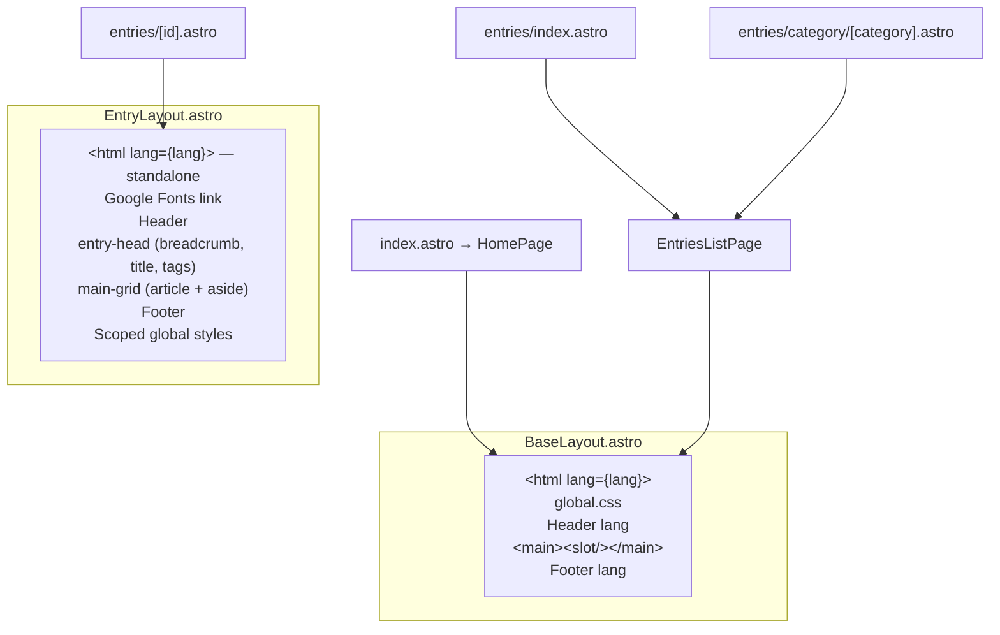

# Routing & Pages

Astro uses file-based routing. **Vietnamese** (default locale) has **no URL prefix**: pages live at `src/pages/` root. **English** uses the `/en/...` prefix: files under `src/pages/en/`. Legacy URLs `/vi` and `/vi/*` redirect to `/` and the matching unprefixed paths (see `astro.config.mjs` `redirects` and `public/_redirects`).

## Route Map

| URL Pattern | File | Layout | Description |
|------------|------|--------|-------------|
| `/` | `src/pages/index.astro` | `BaseLayout` (via `HomePage`) | Home — hero, featured entries, category grid, quote (VI) |
| `/en/` | `src/pages/en/index.astro` | same | Home (EN) |
| `/about`, `/en/about` | `src/pages/about.astro`, `src/pages/en/about.astro` | `BaseLayout` | About — mission, contribute/issue CTAs (placeholders), roadmap |
| `/entries`, `/en/entries` | `src/pages/entries/index.astro`, `src/pages/en/entries/index.astro` | `BaseLayout` (via `EntriesListPage`) | Full catalog (EN uses VI fallback for missing files) |
| `/entries/category/[category]`, `/en/entries/category/[category]` | `src/pages/entries/category/[category].astro`, `src/pages/en/entries/category/[category].astro` | `BaseLayout` (via `EntriesListPage`) | Filtered list by category |
| `/entries/[id]`, `/en/entries/[id]` | `src/pages/entries/[id].astro`, `src/pages/en/entries/[id].astro` | `EntryLayout` | Entry detail (EN falls back to VI markdown when no EN file) |

## Request Flow

```mermaid
graph TD
    subgraph "Build Time (getStaticPaths)"
        A[getLocalizedEntries / getLocalizedEntry] --> B{Filter: status = published}
        B --> C[Generate static paths per locale + id/category]
    end

    subgraph "URL Resolution"
        D["/ "] --> F["index.astro / HomePage"]
        E["/en/"] --> FEN["en/index.astro"]
        G["/entries"] --> H["entries/index.astro"]
        I["/entries/category/than-linh"] --> J[category/[category].astro]
        K["/entries/thanh-giong"] --> L["[id].astro"]
    end

    subgraph "Layout Selection"
        F --> M[BaseLayout lang=vi]
        FEN --> MEN[BaseLayout lang=en]
        H --> N[EntriesListPage → BaseLayout]
        J --> N
        L --> O[EntryLayout — standalone]
    end
```

## Layout Hierarchy



**Key distinction**: `EntryLayout` does NOT extend `BaseLayout`. It is a complete standalone HTML document with its own `<html>`, font imports, and extensive scoped styles.

## Page Details

### Home Page (`/`, `/en/`)

Files: `src/pages/index.astro` (wraps `src/components/HomePage.astro` with `lang="vi"`), `src/pages/en/index.astro` (`lang="en"`).

**Data fetching:**
- `getLocalizedEntries(lang)` → published entries for that locale (EN includes VI fallbacks for missing EN files)
- Fisher-Yates shuffle → random `featured` (first) + `sideEntries` (next 3)
- Category grid uses `CATEGORY_SLUGS` + `getCategoryLabel(slug, lang)`; links use `localePath(lang, ...)` from `src/i18n/paths.ts`

**Sections:**
1. Hero — `t(lang, ...)` for titles and CTAs
2. Featured — random featured entry card + 3 side cards
3. Categories — grid of category cards (locale-aware hrefs)
4. Quote — blockquote (anchor `id="quote"`)

### Entries Catalog (`/entries`, `/en/entries`)

Files: `src/pages/entries/index.astro`, `src/pages/en/entries/index.astro`

**Data fetching:**
- `getLocalizedEntries(lang)`, sorted by `popularity` desc → `name_vi` asc (Vietnamese locale)

**Delegates to**: `EntriesListPage.astro` with `activeCategory={null}` and `lang`

### Category Page (`/entries/category/[category]`, …)

Files: `src/pages/entries/category/[category].astro`, `src/pages/en/entries/category/[category].astro`

**Static paths**: Generated from `CATEGORY_SLUGS` per locale tree

**Data fetching:**
- Same sort as catalog, then filtered by `entry.data.category === category`

**Delegates to**: `EntriesListPage.astro` with `activeCategory={category}` and `lang`

### Entry Detail (`/entries/[id]`, …)

Files: `src/pages/entries/[id].astro`, `src/pages/en/entries/[id].astro`

**Static paths**: Published entries per locale (see `getLocalizedEntries` + localized entry resolution).

**Props computed in `getStaticPaths`:**
- `entry` — from merged collection (may be VI content when `lang === 'en'` and EN file absent)
- `related` — top 3 other entries by popularity (excluding current)
- `lang`

**Rendering:**
- `render(entry)` → `{ Content }` component for markdown body
- Passed to `EntryLayout` as `<Content />` slot

## getStaticPaths Pattern

Entry detail example (one locale per file):

```typescript
export async function getStaticPaths() {
  const lang = 'vi' as const;
  const paths = [];
  const entries = await getLocalizedEntries(lang);
  const published = entries.filter((e) => e.data.status === 'published');
  for (const entry of published) {
    paths.push({
      params: { id: entry.id },
      props: { entry, related: /* ... */ },
    });
  }
  return paths;
}
```

Category pages: `CATEGORY_SLUGS` mapped to `{ params: { category } }` in each locale file.

See `src/pages/entries/**/*.astro` and `src/pages/en/entries/**/*.astro` for implementations.
