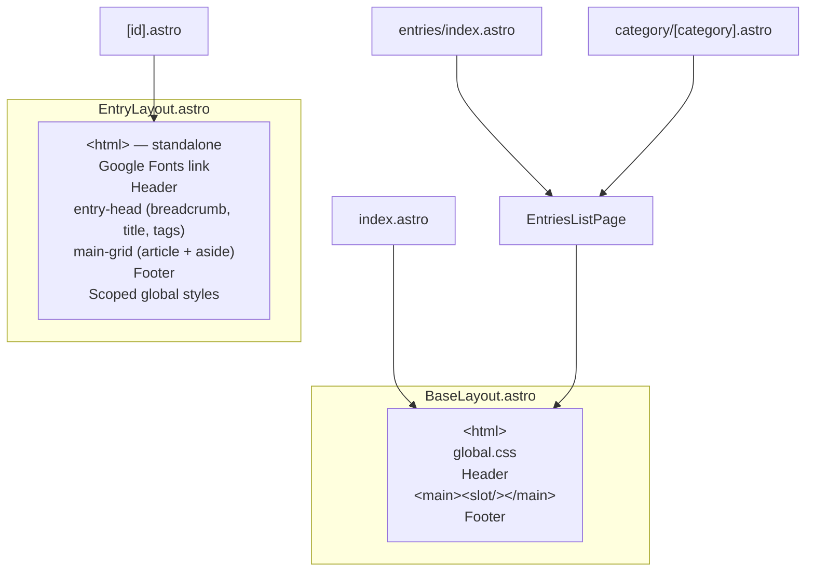

# Routing & Pages

Astro uses file-based routing. Every `.astro` file in `src/pages/` becomes a URL.

## Route Map

| URL Pattern | File | Layout | Description |
|------------|------|--------|-------------|
| `/` | `src/pages/index.astro` | `BaseLayout` | Home — hero, featured entries, category grid, quote |
| `/entries` | `src/pages/entries/index.astro` | `BaseLayout` (via `EntriesListPage`) | Full catalog of all published entries |
| `/entries/category/[category]` | `src/pages/entries/category/[category].astro` | `BaseLayout` (via `EntriesListPage`) | Filtered list by category |
| `/entries/[id]` | `src/pages/entries/[id].astro` | `EntryLayout` | Entry detail page |

## Request Flow

```mermaid
graph TD
    subgraph "Build Time (getStaticPaths)"
        A[getCollection entries] --> B{Filter: status = published}
        B --> C[Generate static paths]
    end

    subgraph "URL Resolution"
        D["/ "] --> E[index.astro]
        F["/entries"] --> G[entries/index.astro]
        H["/entries/category/than-linh"] --> I[category/[category].astro]
        J["/entries/thanh-giong"] --> K["[id].astro"]
    end

    subgraph "Layout Selection"
        E --> L[BaseLayout]
        G --> M[EntriesListPage → BaseLayout]
        I --> M
        K --> N[EntryLayout — standalone]
    end
```

## Layout Hierarchy



**Key distinction**: `EntryLayout` does NOT extend `BaseLayout`. It is a complete standalone HTML document with its own `<html>`, font imports, and extensive scoped styles.

## Page Details

### Home Page (`/`)

File: `src/pages/index.astro`

**Data fetching:**
- `getCollection('entries', e => e.data.status === 'published')` → all published entries
- Fisher-Yates shuffle → random `featured` (first) + `sideEntries` (next 3)
- Static `categories` array (8 items, hardcoded in frontmatter script)

**Sections:**
1. Hero — title "Thần Thoại Việt Nam", CTA buttons
2. Featured — random featured entry card + 3 side cards
3. Categories — 4×2 grid of category cards (all link to `/entries`, NOT per-category)
4. Quote — blockquote placeholder

### Entries Catalog (`/entries`)

File: `src/pages/entries/index.astro`

**Data fetching:**
- All published entries, sorted by `popularity` desc → `name_vi` asc (Vietnamese locale)

**Delegates to**: `EntriesListPage.astro` with `activeCategory={null}`

### Category Page (`/entries/category/[category]`)

File: `src/pages/entries/category/[category].astro`

**Static paths**: Generated from `CATEGORY_SLUGS` (8 categories)

**Data fetching:**
- Same sort as catalog, then filtered by `entry.data.category === category`

**Delegates to**: `EntriesListPage.astro` with `activeCategory={category}`

### Entry Detail (`/entries/[id]`)

File: `src/pages/entries/[id].astro`

**Static paths**: One path per published entry, `id` = entry.id (filename without `.md`)

**Props computed in `getStaticPaths`:**
- `entry` — the current entry
- `related` — top 3 other entries by popularity (excluding current)

**Rendering:**
- `render(entry)` → `{ Content }` component for markdown body
- Passed to `EntryLayout` as `<Content />` slot

## getStaticPaths Pattern

All dynamic routes use the same pattern:

```typescript
export async function getStaticPaths() {
  const entries = await getCollection('entries');
  const published = entries.filter(e => e.data.status === 'published');
  return published.map((entry) => ({
    params: { id: entry.id },
    props: { entry, related: /* computed */ },
  }));
}
```

For category pages:

```typescript
export async function getStaticPaths() {
  return CATEGORY_SLUGS.map((category) => ({ params: { category } }));
}
```
