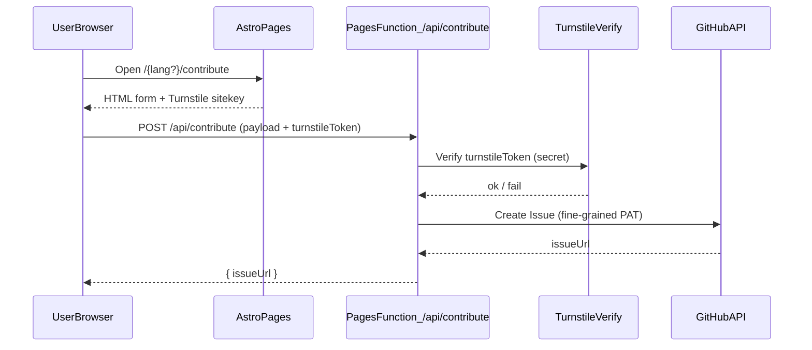

# Contribute UI (GitHub Issue) + Cloudflare Pages Functions + Turnstile

Date: 2026-05-05  
Status: proposed (awaiting approval)  
Scope: implement **Approach 2** — guided UI for **new entry + edit existing entry**, submit to **GitHub Issues** via **Cloudflare Pages Functions**, protected by **Cloudflare Turnstile** (CAPTCHA) + basic abuse controls.  
Non-goals: auto-create PRs; user auth/accounts; database; moderation tooling.

## Context

Repo is Astro static site with dynamic-locale routing under `src/pages/[...lang]/...` and UI strings via `t(lang, key)` in `src/i18n/config.ts`. Deploy target: Cloudflare Pages. No backend.

Contribution must work for **private GitHub repo**.

## Goals / Success criteria

- Provide a polished `/contribute` page (locale-aware) that lets community submit:
  - **New entry proposal** (structured fields + markdown body)
  - **Edit proposal** for existing entry (choose entry + describe + proposed markdown)
- On submit, backendless flow:
  - Browser POST → **Cloudflare Pages Function** `/api/contribute`
  - Function verifies **Turnstile** token
  - Function creates **GitHub Issue** in the private repo
  - UI shows Issue URL + next steps
- No locale routing duplication; all UI copy localized (VI/EN at minimum, extensible).
- Abuse control: CAPTCHA + honeypot + payload validation + size caps.

## High-level architecture

## Routes & integration points

### New page

- Add page: `src/pages/[...lang]/contribute.astro`
  - Uses `BaseLayout`
  - Uses locale routing helpers: export `getStaticPaths()` using `localeStaticPaths()` from `src/i18n/paths.ts` so the route exists for default and non-default locales without duplicating page trees
  - All strings from `t(lang, ...)`

### Wire existing CTA links

- `src/components/Footer.astro`: replace `href="#"` for contribute with `localePath(lang, '/contribute')`
- `src/components/AboutPage.astro`: replace contribute CTA `href="#"` with same

## UI/UX spec (Contribute page)

### Structure

- Hero:
  - eyebrow: “Đóng góp” / “Contribute”
  - title: “Gửi đóng góp cho kho truyện” / “Submit a contribution”
  - lead: explain “submissions become GitHub Issues; maintainers review; merged later”
- Mode switch:
  - `New entry` / `Edit an entry`
  - Defaults to `New entry`
- Form:
  - Consistent with existing site styling tokens (`--paper`, `--ink`, `--vermilion`, `--line`, fonts)
  - Accessibility: labels, aria-live for errors/success, focus styles
- Preview panel (optional but recommended):
  - Client-only markdown preview of submitted markdown body (no external dep if feasible)
  - If preview too heavy, omit; keep output deterministic

### Form fields

Common fields (both modes):
- **displayName** (optional): contributor name/nickname
- **contactEmail** (optional): for follow-up (note: appears in GitHub issue; user consent text)
- **sources** (optional): list of URLs / citations (textarea)
- **notes** (optional): context for maintainers
- **honeypot** (hidden input): e.g. `website` must be empty

New entry fields:
- **title** (required)
- **suggestedSlug** (auto-generated from title, editable)
- **category** (optional, select from existing categories if easy; else free text)
- **summary** (optional, short)
- **markdownBody** (required): main content proposal

Edit entry fields:
- **entryId** (required): pick from build-time list of entries (localized titles + ID)
- **changeSummary** (required): what + why
- **proposedMarkdown** (required): proposed markdown (either full file or relevant section)

### Edit-mode entry picker (data source)

- Page frontmatter loads entries with `getLocalizedEntries(lang)` from `src/i18n/content.ts` and builds a compact list for the `<select>`:
  - `id` (required for submission)
  - display label: prefer localized `name_en` when `lang==='en'`, else `name_vi`
- Keep only `status: published` entries (already enforced by `getLocalizedEntries` filter).

### Validation (client)

- Required fields not empty
- Basic size warnings (e.g. > 30k chars)
- Turnstile token presence
- Do not block submit on optional fields

### Submission result UI

- On success:
  - Show “Submitted” state
  - Display Issue link (open in new tab)
  - Show next steps: maintainer review → request changes → later PR
- On failure:
  - Turnstile verification error message
  - Validation errors (field-level)
  - Generic error with retry

## Backend spec (Cloudflare Pages Functions)

### Endpoint

- `POST /api/contribute`
- Accept JSON body:
  - `mode`: `"new"` | `"edit"`
  - `turnstileToken`: string
  - plus fields per mode (see UI)

### Behavior

1. Reject non-POST
2. Parse JSON; reject invalid JSON
3. Enforce **size caps**:
   - max JSON body size (by character count after parse)
   - max markdown/proposed content length
4. Honeypot:
   - if `website` (or chosen field) non-empty → return 200 with generic response OR 400 (decision during impl); must not create issue
5. Verify Turnstile:
   - call Turnstile verify endpoint with `TURNSTILE_SECRET_KEY`
   - include client IP if available via request headers (Cloudflare provides)
6. Compose Issue:
   - Title format:
     - New: `[Contribute] New entry: <title>`
     - Edit: `[Contribute] Edit: <entryId>`
   - Body:
     - Structured markdown section headings for maintainers
     - Include locale if relevant
     - Include submitted fields, sources, and content in fenced blocks
     - Include caution note about private repo + email visibility
   - Labels:
     - `contribution`
     - `new-entry` or `edit-entry`
7. Create GitHub Issue via API:
   - `POST /repos/{owner}/{repo}/issues`
   - Use fine-grained PAT from secret
8. Return JSON `{ issueUrl }`

### Secrets / env vars

Cloudflare Pages project settings:

- **Secrets**
  - `TURNSTILE_SECRET_KEY`
  - `GITHUB_TOKEN` (fine-grained PAT with repo access)
- **Environment variables (non-secret)**
  - `GITHUB_REPO` = `owner/repo`
  - `TURNSTILE_SITE_KEY` (public)

### GitHub permissions (private repo)

Preferred: **fine-grained personal access token**:
- Resource owner: your account/org
- Repository access: select the private repo
- Repository permissions:
  - **Issues: Read & Write**

No need for Contents/PR permissions because we are not creating commits/branches/PRs.

### Error handling

- Turnstile fail → `400` with `{ error: 'turnstile_failed' }`
- Validation fail → `400` with `{ error: 'invalid_request', details: [...] }`
- GitHub fail → `502` with `{ error: 'github_failed' }` (do not leak token/headers)

## Turnstile configuration

- Create Turnstile widget in Cloudflare dashboard:
  - Site: your domain (Pages custom domain) and preview domain if needed
  - Widget mode: managed
- Frontend uses Turnstile script + sitekey.
- Backend verifies with secret key.

## Deploy guide (Cloudflare Pages)

### Pages Functions

- Place function under: `functions/api/contribute.ts` (Pages Functions convention)
- Deploy via Cloudflare Pages (Git integration): pushes to `main` trigger build/deploy.

### Configure env

In Pages project settings:
- Add env var `GITHUB_REPO`
- Add env var `TURNSTILE_SITE_KEY`
- Add secret `TURNSTILE_SECRET_KEY`
- Add secret `GITHUB_TOKEN`

## i18n requirements

Add new UI keys to `src/i18n/config.ts` for VI and EN:

- `contribute.title`, `contribute.lead`, `contribute.mode.new`, `contribute.mode.edit`
- `contribute.form.*` labels and placeholders
- `contribute.submit`, `contribute.submitting`, `contribute.success`, `contribute.failure.*`
- `contribute.privacyNote` (email visibility / repo private note)

Must not hardcode strings in templates except rare non-user-visible constants.

## Testing / verification (post-implementation)

- Local dev:
  - Confirm `/contribute` route renders for both locales.
  - Confirm form validation and UI states.
- Staging:
  - Deploy preview branch; test Turnstile verify works on preview domain.
  - Submit both modes; confirm Issues created in private repo with correct labels/body.
- Abuse checks:
  - Honeypot filled → no issue created.
  - Turnstile invalid → no issue created.

## Open decisions (resolved for this spec)

- Contribution target: **GitHub Issue** (selected)
- Function hosting: **Cloudflare Pages Functions** (selected)
- Modes supported: **both** new + edit (selected)

